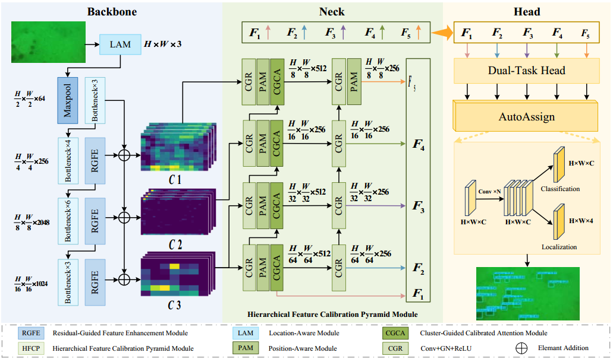
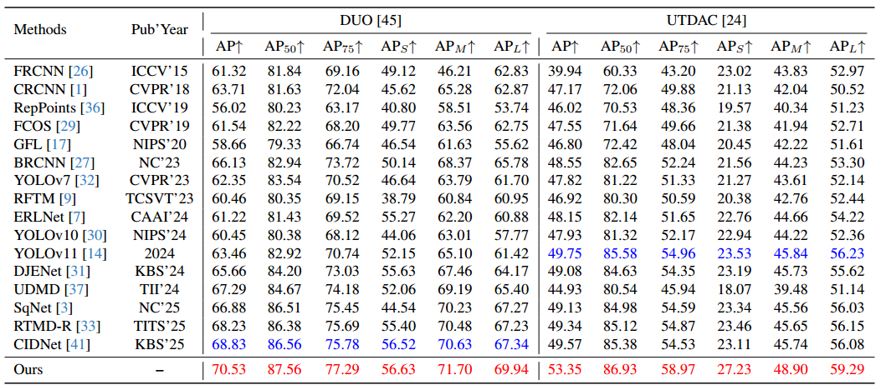

# RHCNet: Residual-Guided Hierarchical Calibration Network for Robust Underwater Object Detection

This repository contains the code (in PyTorch) 

## Introduction

Underwater images commonly suffer from foreground-background ambiguity, loss of structural details, and severely reduced contrast, which collectively make underwater object detection (UOD) an inherently challenging task. To handle this issue, we present a residual-guided hierarchical calibration network (RHCNet) designed to achieve more efficient and robust UOD, which comprises a residual-guided feature enhancement module (RGFE) and a hierarchical feature calibration pyramid module (HFCP). Concretely, RHCNet extends the standard ResNet-50 backbone by embedding the RGFE, which effectively strengthens the representation of edge and texture features in blurry regions by jointly leveraging convolutional operations and attention mechanisms to achieve more discriminative feature extraction for UOD. Subsequently, the HFCP integrates a bottom-up semantic enhancement path and a top-down fine-grained feature compensation path, while a K-means clustering–guided feature calibration module is jointly employed to ensure multi-level cross-scale semantic consistency and accurate alignment of salient region features. Extensive experiments on the DUO and UTDAC benchmark datasets demonstrated that our RHCNet attains the highest AP scores of 70.5% and 50.8%, respectively. Besides, our RHCNet also maintains excellent detection accuracy and strong generalization capability on the COCO dataset for terrestrial scenarios.



## Dependencies

- Python == 3.7.11
- PyTorch == 1.10.1
- mmdetection == 2.22.0
- mmcv == 1.4.0
- numpy == 1.21.2

## Installation

The basic installation follows with [mmdetection](https://github.com/mousecpn/mmdetection/blob/master/docs/get_started.md). It is recommended to use manual installation. 

## Datasets

**DUO**: https://github.com/chongweiliu/DUO

**UTDAC2020**: https://drive.google.com/file/d/1avyB-ht3VxNERHpAwNTuBRFOxiXDMczI/view?usp=sharing


Other underwater datasets: https://github.com/mousecpn/Collection-of-Underwater-Object-Detection-Dataset

After downloading all datasets, create udmdet document.

```
$ cd data
$ mkdir udmdet
```

It is recommended to symlink the dataset root to `$data`.

```
udmdet
├── data
│   ├── DUO
│   │   ├── annotaions
│   │   ├── train2017
│   │   ├── test2017
```


## Train

```
$ python tools/train.py configs/rhcnet/rhcnet_tood_r50_fpn_anchor_based_2x_duoc.py
```

## Test

```
$ python tools/test.py configs/rhcnet/rhcnet_tood_r50_fpn_anchor_based_2x_duo.py <path/to/checkpoints> --eval bbox
```


## Results




## Acknowledgement

Thanks MMDetection team for the wonderful open source project!


